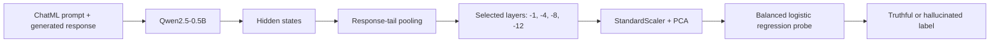

# LLM Hallucination Detection Probe

A reproducible machine learning project for detecting hallucinated answers from
a small language model using transformer hidden states and a lightweight probe
classifier.

This repository started as a SMILES-2026 hallucination detection submission and
has been documented as a portfolio-ready NLP project. The official competition
report, reproducibility details, experiments, and submission links are in
[SOLUTION.md](./SOLUTION.md).

## Highlights

- Built an end-to-end hallucination detection pipeline around
  `Qwen/Qwen2.5-0.5B` hidden states.
- Engineered multi-layer response-tail features from transformer activations.
- Reduced overfitting with PCA and balanced logistic regression.
- Compared multiple pooling strategies, layer selections, regularization
  settings, and optional geometric features.
- Generated `results.json` and competition-ready `predictions.csv` with one
  command.

## Problem

Large language models can produce fluent answers that are factually incorrect.
This project trains a binary probe to classify a model response as:

- `0`: truthful
- `1`: hallucinated

Each sample contains a ChatML prompt, a generated response, and a hallucination
label. Instead of fine-tuning the language model, the solution reads internal
hidden states from Qwen2.5-0.5B and trains a compact downstream classifier.

## Pipeline



## Final Approach

The final probe uses response-focused hidden-state features:

- selected transformer layers: `-1`, `-4`, `-8`, `-12`
- pooled vectors per selected layer:
  - final real token representation
  - mean representation over the final 64 real tokens
- dimensionality reduction: `PCA(n_components=128)`
- classifier: balanced logistic regression with `C=0.5`
- split strategy: deterministic stratified train/validation/internal-test split

The largest improvement came from switching from full-sequence pooling to
response-tail pooling and selecting more widely spaced transformer layers. This
made the probe focus more on the generated answer rather than the full prompt.

## Results

Internal evaluation from the official `python3 solution.py` run:

| Checkpoint | Accuracy | F1 | AUROC |
| --- | ---: | ---: | ---: |
| Majority baseline | 70.19% | 82.49% | N/A |
| Probe train | 86.07% | 90.25% | 93.50% |
| Probe validation | 81.73% | 87.25% | 81.62% |
| Probe test | 72.12% | 80.00% | 69.16% |

The full experiment table, discarded attempts, and final rationale are
documented in [SOLUTION.md](./SOLUTION.md).

## Repository Structure

```text
.
├── aggregation.py          # Hidden-state layer selection and pooling
├── probe.py                # PCA + balanced logistic regression probe
├── splitting.py            # Deterministic stratified data split
├── solution.py             # Main reproducible entry point
├── model.py                # Qwen2.5-0.5B loader
├── evaluate.py             # Evaluation and artifact saving utilities
├── data/
│   ├── dataset.csv         # Labelled training/evaluation data
│   └── test.csv            # Unlabelled competition test data
├── results.json            # Internal evaluation metrics
├── predictions.csv         # Generated competition predictions
├── SOLUTION.md             # Official SMILES-2026 solution report
└── docs/
    ├── github-profile.md   # Suggested repo name, topics, and profile copy
    └── portfolio-summary.md
```

## Quick Start

```bash
git clone https://github.com/Duvi-M/SMILES-2026-Hallucination-Detection.git
cd SMILES-2026-Hallucination-Detection

python3 -m venv .venv
source .venv/bin/activate
python3 -m pip install -r requirements.txt
python3 solution.py
```

Running `python3 solution.py` writes:

- `results.json`: internal split metrics and metadata
- `predictions.csv`: predictions for the unlabelled test set

The first run downloads `Qwen/Qwen2.5-0.5B` from Hugging Face unless the model
is already cached locally. A GPU, Apple Silicon MPS, or Colab T4 is recommended.

## Data

`data/dataset.csv` contains 689 labelled samples:

| Column | Description |
| --- | --- |
| `prompt` | ChatML-formatted conversation context |
| `response` | Generated model response |
| `label` | `0.0` = truthful, `1.0` = hallucinated |

`data/test.csv` follows the same schema, with null labels. The generated
prediction file contains:

```csv
id,label
```

## Design Decisions

- Used hidden states instead of text-only features to inspect the model's
  internal representation of its own answer.
- Kept the classifier lightweight to reduce overfitting on a small labelled
  dataset.
- Added PCA before logistic regression because the raw hidden-state feature
  vector is high-dimensional.
- Used response-tail pooling because hallucination evidence is more likely to
  appear in the generated answer than in the full prompt.
- Kept optional geometric features disabled because they added complexity
  without a meaningful validation gain in this split.

## Portfolio Notes

This project is strongest as a portfolio example of reproducible applied ML:

- feature engineering with transformer activations
- careful validation and overfitting control
- experiment tracking through a written report
- one-command reproducibility
- clear separation between fixed infrastructure and implemented components

Suggested GitHub topics and profile copy are in
[docs/github-profile.md](./docs/github-profile.md). A short CV/LinkedIn-ready
summary is in [docs/portfolio-summary.md](./docs/portfolio-summary.md).

## Limitations

- The probe is evaluated on a small labelled dataset.
- The final approach uses one deterministic split rather than an ensemble.
- Prompt/response token boundaries are approximated with response-tail pooling.
- Further gains may come from cross-validation, calibration, ensembling, or
  exact response-only token boundary handling.

## License

See [LICENSE](./LICENSE).
